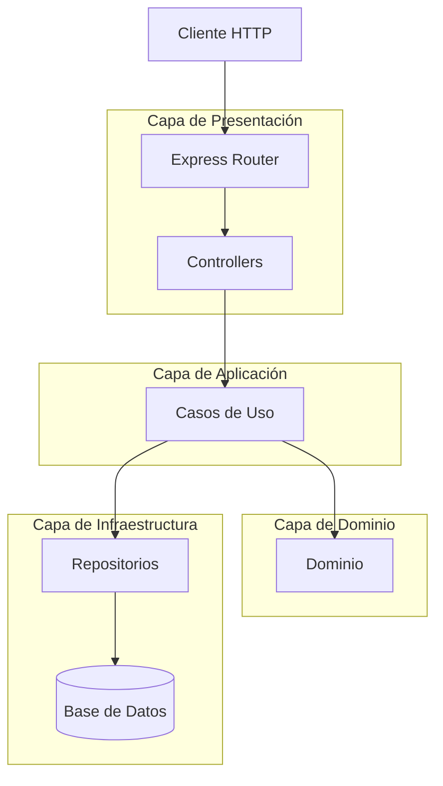
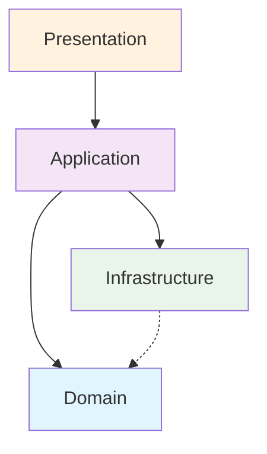
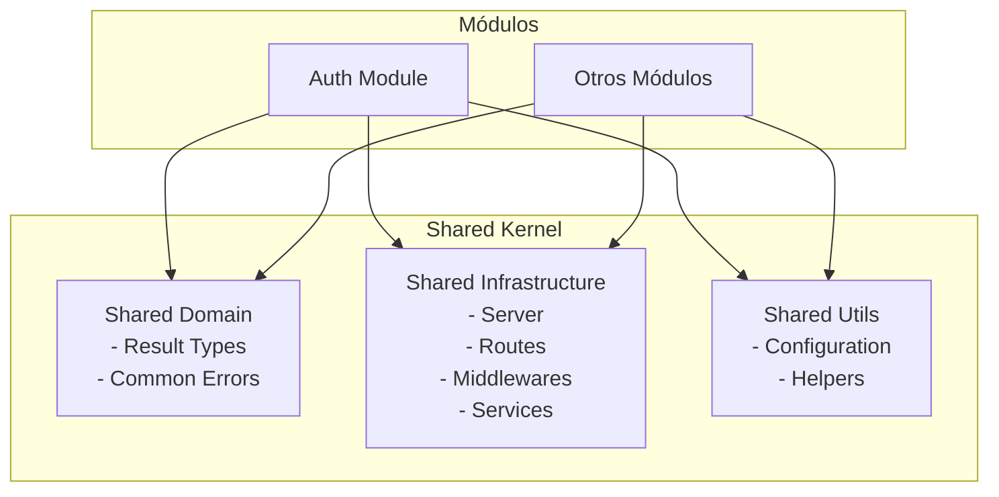
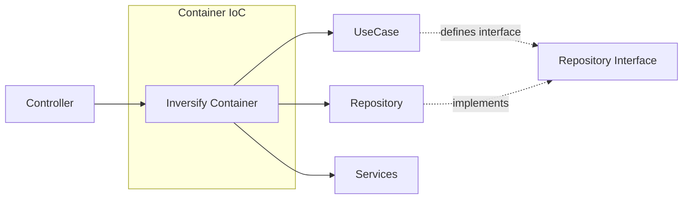

# Arquitectura de la API Atlas

## Introducción

La API de Atlas está diseñada como un **monolito modular** que implementa principios de **arquitectura limpia**. Esta aproximación permite mantener la simplicidad operacional de un monolito mientras se preserva la modularidad y escalabilidad del código.

## Visión General de la Arquitectura

### 1. Monolito Modular

La aplicación está estructurada como un único artefacto deployable, pero internamente organizada en módulos independientes que pueden evolucionar de forma autónoma.

**Beneficios:**

- Simplicidad operacional (un solo deploy, un solo proceso)
- Facilita transacciones distribuidas y consistencia de datos
- Menor complejidad de red y comunicación
- Debugging y testing más simples

### 2. Arquitectura

Cada módulo implementa el principio de responsabilidad única y se organiza en capas:



## Estructura de Módulos

### Organización de carpetas

Cada módulo funcional sigue la misma estructura de capas:

```
modules/{module-name}/
├── domain/          # Reglas de negocio puras
│   ├── entities/    # Entidades de dominio
│   ├── repository/  # Interfaces de repositorios
│   └── errors/      # Errores específicos del dominio
├── application/     # Casos de uso y orchestación
│   └── usecases/    # Implementación de casos de uso
├── infrastructure/  # Implementaciones concretas
│   ├── repository/  # Implementación de repositorios
│   ├── services/    # Servicios externos
│   └── container.ts # Configuración de dependencias
└── presentation/    # Capa de presentación HTTP
    ├── controller.ts
    └── routes.ts
```

### Flujo de Dependencias



**Reglas de Dependencia:**

- Las capas internas no conocen las capas externas
- La capa de dominio es independiente de frameworks
- Las dependencias apuntan hacia el centro (dominio)

## Shared Kernel

El código compartido entre módulos se organiza en `src/shared/`:



## Gestión de Dependencias

### Inversión de Control

Utilizamos **Inversify** para implementar inversión de dependencias:



Escalabilidad del Diseño

### Adición de Nuevos Módulos

Para agregar un nuevo módulo:

1. Crear estructura de carpetas siguiendo la convención
2. Implementar las cuatro capas (domain, application, infrastructure, presentation)
3. Registrar dependencias en el contenedor IoC
4. Agregar rutas al router principal

## Consideraciones de Diseño

### Ventajas del Enfoque Actual

- **Simplicidad operacional**: Un solo artefacto para desplegar
- **Consistencia transaccional**: Fácil manejo de transacciones
- **Performance**: Sin latencia de red entre módulos
- **Testing**: Pruebas de integración más simples
- **Debugging**: Trazabilidad completa en un solo proceso

### Trade-offs

- **Escalabilidad independiente**: Los módulos no pueden escalarse por separado
- **Tecnología homogénea**: Todos los módulos deben usar el mismo stack
- **Despliegue acoplado**: Cambios en cualquier módulo requieren redeploy completo

## Patrones Implementados

- **Repository Pattern**: Abstracción de acceso a datos
- **Use Case Pattern**: Encapsulación de lógica de negocio
- **Dependency Injection**: Inversión de control
- **Result Pattern**: Manejo de errores sin excepciones
- **Module Pattern**: Organización modular del código
