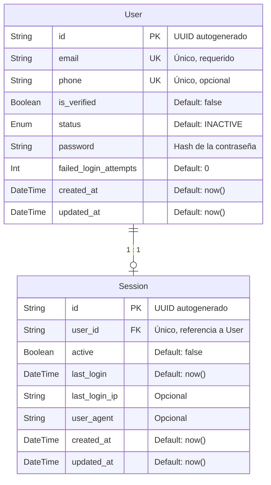

# Base de Datos - Atlas API

## Introducción

La API de Atlas utiliza **PostgreSQL** como motor de base de datos relacional, gestionado a través de **Prisma ORM**. Los schemas están organizados en archivos `.prisma` separados por entidad dentro de `src/shared/infrastructure/data/schema/`.

---

## Tecnologías

| Tecnología | Versión | Propósito                                 |
| ---------- | ------- | ----------------------------------------- |
| PostgreSQL | >= 14   | Motor de base de datos relacional         |
| Prisma ORM | latest  | Gestión de schemas, migraciones y cliente |

---

## Estructura de Archivos

```
apps/api/src/shared/infrastructure/data/schema/
├── schema.prisma   # Configuración global (datasource y generator)
├── user.prisma     # Modelo User y enum UserStatus
└── session.prisma  # Modelo Session
```

---

## Diagrama Entidad-Relación



---

## Tablas

### `User`

Representa a un usuario registrado en el sistema. Almacena credenciales de acceso, estado de la cuenta y metadatos de seguridad.

| Columna                 | Tipo            | Restricciones      | Default    | Descripción                            |
| ----------------------- | --------------- | ------------------ | ---------- | -------------------------------------- |
| `id`                    | `String (UUID)` | `PK`               | `uuid()`   | Identificador único del usuario        |
| `email`                 | `String`        | `UNIQUE, NOT NULL` | —          | Correo electrónico del usuario         |
| `phone`                 | `String`        | `UNIQUE, NULLABLE` | `NULL`     | Teléfono del usuario                   |
| `is_verified`           | `Boolean`       | `NOT NULL`         | `false`    | Indica si el correo fue verificado     |
| `status`                | `UserStatus`    | `NOT NULL`         | `INACTIVE` | Estado actual de la cuenta             |
| `password`              | `String`        | `NOT NULL`         | —          | Hash de la contraseña                  |
| `failed_login_attempts` | `Int`           | `NOT NULL`         | `0`        | Contador de intentos fallidos de login |
| `created_at`            | `DateTime`      | `NOT NULL`         | `now()`    | Fecha de creación del registro         |
| `updated_at`            | `DateTime`      | `NOT NULL`         | `now()`    | Fecha de última actualización          |

**Relaciones:**

- `session` → `Session` (1 a 0..1): Un usuario puede tener una sesión activa.

---

### `Session`

Almacena la sesión de autenticación de un usuario. Registra información de seguridad como IP y user agent del último acceso.

| Columna         | Tipo            | Restricciones          | Default  | Descripción                               |
| --------------- | --------------- | ---------------------- | -------- | ----------------------------------------- |
| `id`            | `String (UUID)` | `PK`                   | `uuid()` | Identificador único de la sesión          |
| `user_id`       | `String`        | `FK, UNIQUE, NOT NULL` | —        | Referencia al usuario dueño de la sesión  |
| `active`        | `Boolean`       | `NOT NULL`             | `false`  | Indica si la sesión está activa           |
| `last_login`    | `DateTime`      | `NOT NULL`             | `now()`  | Fecha y hora del último inicio de sesión  |
| `last_login_ip` | `String`        | `NULLABLE`             | `NULL`   | Dirección IP del último login             |
| `user_agent`    | `String`        | `NULLABLE`             | `NULL`   | User agent del cliente en el último login |
| `created_at`    | `DateTime`      | `NOT NULL`             | `now()`  | Fecha de creación del registro            |
| `updated_at`    | `DateTime`      | `NOT NULL`             | `now()`  | Fecha de última actualización             |

**Relaciones:**

- `user` → `User` (N a 1): Cada sesión pertenece a exactamente un usuario.

---

## Enums

### `UserStatus`

Define el estado de la cuenta de un usuario.

| Valor      | Descripción                                                   |
| ---------- | ------------------------------------------------------------- |
| `ACTIVE`   | La cuenta está activa y puede iniciar sesión                  |
| `INACTIVE` | La cuenta fue creada pero aún no fue activada                 |
| `BLOCKED`  | La cuenta fue bloqueada (ej. por múltiples intentos fallidos) |

---

## Convenciones

- **Identificadores:** Todos los modelos usan `UUID` generado automáticamente como clave primaria.
- **Nombres de columnas:** Se usa `snake_case` en la base de datos y `camelCase` en el código TypeScript. La correspondencia se declara con `@map` en Prisma.
- **Timestamps:** Todos los modelos incluyen `created_at` y `updated_at` para auditoría.
- **Campos opcionales:** Los campos que pueden ser `NULL` se declaran con `?` en el schema de Prisma.
