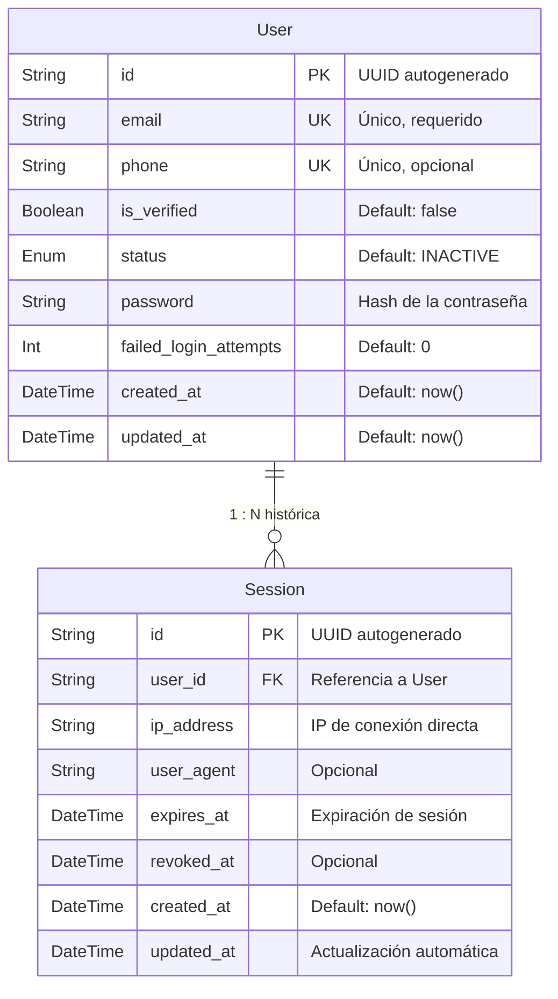

# Base de Datos - Atlas API

## Introducción

La API de Atlas utiliza **PostgreSQL** como motor de base de datos relacional, gestionado a través de **Prisma ORM**. Los schemas están organizados en archivos `.prisma` separados por entidad dentro de `src/shared/infrastructure/data/schema/`.

---

## Tecnologías

| Tecnología | Versión | Propósito                                 |
| ---------- | ------- | ----------------------------------------- |
| PostgreSQL | >= 14   | Motor de base de datos relacional         |
| Prisma ORM | latest  | Gestión de schemas, migraciones y cliente |

---

## Estructura de Archivos

```
apps/api/src/shared/infrastructure/data/schema/
├── schema.prisma   # Configuración global (datasource y generator)
├── user.prisma     # Modelo User y enum UserStatus
└── session.prisma  # Modelo Session
```

---

## Diagrama Entidad-Relación


```mermaid
erDiagram
    User {
        String  id                  PK  "UUID autogenerado"
        String  email               UK  "Único, requerido"
        String  phone               UK  "Único, opcional"
        Boolean is_verified             "Default: false"
        Enum    status                  "Default: INACTIVE"
        String  password                "Hash de la contraseña"
        Int     failed_login_attempts   "Default: 0"
        DateTime created_at             "Default: now()"
        DateTime updated_at             "Default: now()"
    }

    Session {
        String   id              PK  "UUID autogenerado"
        String   user_id         FK  "Referencia a User"
        String   ip_address          "IP de conexión directa"
        String   user_agent          "Opcional"
        DateTime expires_at          "Expiración de sesión"
        DateTime revoked_at          "Opcional"
        DateTime created_at          "Default: now()"
        DateTime updated_at          "Actualización automática"
    }

    User ||--o{ Session : "1 : N histórica"
```

---

## Tablas

### `User`

Representa a un usuario registrado en el sistema. Almacena credenciales de acceso, estado de la cuenta y metadatos de seguridad.

| Columna                 | Tipo            | Restricciones      | Default    | Descripción                            |
| ----------------------- | --------------- | ------------------ | ---------- | -------------------------------------- |
| `id`                    | `String (UUID)` | `PK`               | `uuid()`   | Identificador único del usuario        |
| `email`                 | `String`        | `UNIQUE, NOT NULL` | —          | Correo electrónico del usuario         |
| `phone`                 | `String`        | `UNIQUE, NULLABLE` | `NULL`     | Teléfono del usuario                   |
| `is_verified`           | `Boolean`       | `NOT NULL`         | `false`    | Indica si el correo fue verificado     |
| `status`                | `UserStatus`    | `NOT NULL`         | `INACTIVE` | Estado actual de la cuenta             |
| `password`              | `String`        | `NOT NULL`         | —          | Hash de la contraseña                  |
| `failed_login_attempts` | `Int`           | `NOT NULL`         | `0`        | Contador de intentos fallidos de login |
| `created_at`            | `DateTime`      | `NOT NULL`         | `now()`    | Fecha de creación del registro         |
| `updated_at`            | `DateTime`      | `NOT NULL`         | `now()`    | Fecha de última actualización          |

**Relaciones:**

- `sessions` → `Session` (1 a N): Un usuario conserva el historial de sesiones; como máximo una puede permanecer abierta.

---

### `Session`

Almacena el historial de sesiones de autenticación. Cada login exitoso crea una fila nueva y revoca cualquier fila abierta anterior del mismo usuario.

| Columna      | Tipo            | Restricciones         | Default  | Descripción                                      |
| ------------ | --------------- | --------------------- | -------- | ------------------------------------------------ |
| `id`         | `String (UUID)` | `PK`                  | `uuid()` | Identificador único de la sesión                 |
| `user_id`    | `String`        | `FK, NOT NULL`        | —        | Referencia al usuario dueño de la sesión         |
| `ip_address` | `VarChar(45)`   | `NOT NULL`            | —        | IP de la conexión directa que inició la sesión   |
| `user_agent` | `VarChar(512)`  | `NULLABLE`            | `NULL`   | User-agent normalizado y truncado, no autoritativo |
| `expires_at` | `DateTime`      | `NOT NULL`            | —        | Momento en que deja de estar vigente             |
| `revoked_at` | `DateTime`      | `NULLABLE`            | `NULL`   | Momento de revocación; `NULL` significa abierta  |
| `created_at` | `DateTime`      | `NOT NULL`            | `now()`  | Inicio de la sesión                              |
| `updated_at` | `DateTime`      | `NOT NULL, @updatedAt` | —        | Fecha de última actualización                    |

**Relaciones:**

- `user` → `User` (N a 1): Cada sesión pertenece a exactamente un usuario.
- La FK usa `ON DELETE RESTRICT` para impedir borrar un usuario con historial de sesiones.

Una sesión está **abierta** cuando `revoked_at IS NULL`. Está **vigente** cuando además `expires_at > now()`. Un índice único parcial sobre `user_id WHERE revoked_at IS NULL` impide más de una sesión abierta por usuario; el repositorio también serializa los reemplazos mediante un lock de fila del usuario.

Las sesiones revocadas y sus metadatos de IP y user-agent se retienen indefinidamente. La API no habilita `trust proxy`: obtiene la IP desde `req.ip` para la conexión directa y no confía en `X-Forwarded-For`.

### Configuración de sesiones

`SESSION_TTL_DAYS` es una variable de entorno no secreta que define la expiración de nuevas sesiones. Si no existe usa `30`; solo acepta enteros entre `1` y `90`, inclusive. Un valor vacío o inválido impide iniciar la aplicación explícitamente.

---

## Enums

### `UserStatus`

Define el estado de la cuenta de un usuario.

| Valor      | Descripción                                                   |
| ---------- | ------------------------------------------------------------- |
| `ACTIVE`   | La cuenta está activa y puede iniciar sesión                  |
| `INACTIVE` | La cuenta fue creada pero aún no fue activada                 |
| `BLOCKED`  | La cuenta fue bloqueada (ej. por múltiples intentos fallidos) |

---

## Convenciones

- **Identificadores:** Todos los modelos usan `UUID` generado automáticamente como clave primaria.
- **Nombres de columnas:** Se usa `snake_case` en la base de datos y `camelCase` en el código TypeScript. La correspondencia se declara con `@map` en Prisma.
- **Timestamps:** Todos los modelos incluyen `created_at` y `updated_at` para auditoría.
- **Campos opcionales:** Los campos que pueden ser `NULL` se declaran con `?` en el schema de Prisma.
